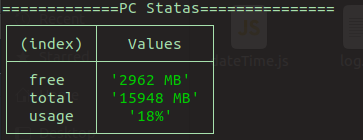
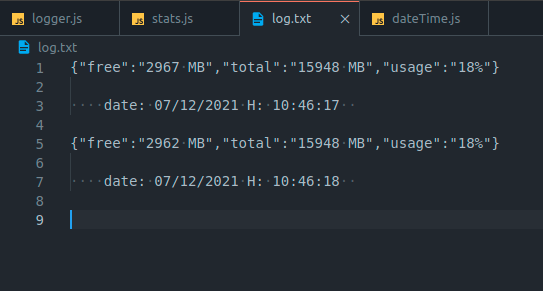

# PC Stats

Servidor em node para verificar o consumo de memoria ram.

#### Instalação

 - 1- tem que ter node instalado 
 - 2- git clone no repositório 

#### Execução

- execute no terminal $ node stats.js

#### Log

